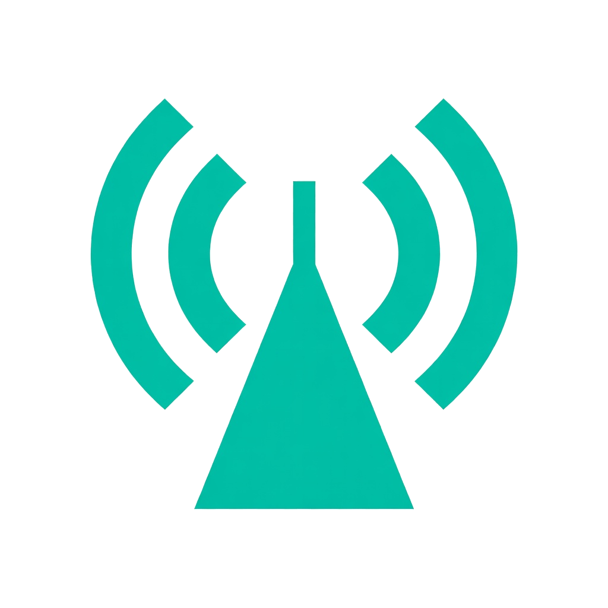

<p align="center">
  
</p>

<h1 align="center">🦞 OpenClaw Node Widget</h1>

<p align="center">
  <strong>Your lobster lives at home. You don't have to.</strong><br>
  <em>Keep your AI agent in your pocket — wherever you go.</em>
</p>

<p align="center">
  <a href="https://github.com/beckyeh8888/openclaw-node-widget-rs/actions"></a>
  <a href="https://github.com/beckyeh8888/openclaw-node-widget-rs/releases/latest"></a>
  <a href="LICENSE"></a>
  <a href="https://github.com/beckyeh8888/openclaw-node-widget-rs/releases"></a>
</p>

---

## The Story / 故事的開始

> My OpenClaw agent runs 24/7 on a Mac mini at home — answering messages, managing cron jobs, monitoring stocks, even doing divination readings for friends.
>
> But when I'm out? I used to have **no idea** if it was still alive.
>
> So I built this. A tiny tray icon that tells me: **green = alive, red = fix it.** One right-click to restart, check diagnostics, or see what went wrong. Works from the café, the office, the train — anywhere with internet.
>
> Now my lobster 🦞 stays home, but I take it everywhere.

> 我的 OpenClaw agent 在家裡的 Mac mini 上 24/7 運行 — 回訊息、跑排程、看盤、幫朋友問卦。
>
> 但出門在外？我根本不知道它是不是還活著。
>
> 所以我做了這個。一個小小的系統列圖示：**綠色 = 活著，紅色 = 去修。** 右鍵一點就能重啟、看錯誤、查診斷。咖啡廳、辦公室、火車上 — 有網路就行。
>
> 現在我的龍蝦 🦞 住在家裡，但隨時跟著我。

---

## Why Node + Widget? / 為什麼用 Node + Widget？

> **You don't need OpenClaw on every computer.**
>
> Install OpenClaw once — on your home server, a Mac mini, a Raspberry Pi, whatever runs 24/7. That's your **Gateway** — the brain.
>
> Every other computer? Just install **Node** (lightweight agent endpoint) + **Widget** (system tray monitor). Node connects back to your Gateway via [Tailscale](https://tailscale.com). Done.
>
> Your AI agent can now **reach into any machine** running Node — run commands, read files, manage processes — all orchestrated from one central Gateway. The Widget lets you see it all at a glance.

> **你不需要每台電腦都裝 OpenClaw。**
>
> OpenClaw 只裝一次 — 家裡的伺服器、Mac mini、Raspberry Pi，任何 24/7 運行的機器。這就是你的 **Gateway** — 大腦。
>
> 其他電腦？只要裝 **Node**（輕量級 agent 端點）+ **Widget**（系統列監控）。Node 透過 [Tailscale](https://tailscale.com) 連回 Gateway。搞定。
>
> 你的 AI agent 現在可以**伸手進任何跑 Node 的機器** — 執行指令、讀檔案、管理程序 — 全部由一個中央 Gateway 協調。Widget 讓你一目了然。

```
┌─────────────────────────────────────────────────┐
│  🏠 Home Server (24/7)                          │
│  ┌───────────┐  ┌──────────┐  ┌──────────────┐  │
│  │  OpenClaw │──│ Gateway  │──│ AI Agents    │  │
│  │  (brain)  │  │ :18789   │  │ main/占卜/... │  │
│  └───────────┘  └────┬─────┘  └──────────────┘  │
│                      │ Tailscale (100.x.x.x)    │
└──────────────────────┼──────────────────────────┘
                       │
        ┌──────────────┼──────────────┐
        │              │              │
   ┌────▼────┐   ┌─────▼────┐   ┌────▼────┐
   │💻 Office │   │🏠 Desktop│   │💻 Laptop│
   │ Node     │   │ Node     │   │ Node    │
   │ Widget 🟢│   │ Widget 🟢│   │ Widget🟢│
   └─────────┘   └──────────┘   └─────────┘
```

---

## What is this? / 這是什麼？

**OpenClaw Node Widget** is a lightweight system tray app that monitors your [OpenClaw](https://openclaw.ai) AI agent node. Think of it as a health dashboard for your always-on AI assistant — but it lives in your taskbar, not a browser tab.

**OpenClaw Node Widget** 是一個輕量級系統列應用，用來監控你的 [OpenClaw](https://openclaw.ai) AI agent。把它想成你 AI 助手的健康儀表板 — 但它住在工作列，不是瀏覽器分頁。

**Works on:** Windows · macOS · Linux  
**Size:** ~9MB · **CPU:** Near zero · **Memory:** ~15MB

---

## ✨ Features / 功能

| | Feature | 功能 |
|---|---------|------|
| 🟢 | **Live Status** — Green/red/yellow tray icon | 即時狀態 — 綠/紅/黃圖示一目了然 |
| 🌐 | **Gateway WebSocket** — Real-time remote monitoring | 即時遠端監控（WebSocket） |
| 🔄 | **One-Click Control** — Start/stop/restart from tray | 一鍵啟動/停止/重啟 |
| 🔒 | **Tailscale Integration** — Auto-detect VPN peers | Tailscale 整合，自動偵測 VPN 節點 |
| 📊 | **Diagnostics** — Latency, errors, copy-to-clipboard | 診斷資訊：延遲、錯誤、一鍵複製 |
| 🔔 | **Smart Notifications** — Status, VPN, updates | 智慧通知：狀態變化、VPN 斷線、更新 |
| ⬇️ | **Auto-Update** — Download + auto-restart | 自動更新 + 自動重啟 |
| 🌍 | **Multi-language** — EN / 繁中 / 简中 | 多語言支援 |
| 🖥️ | **Multi-Node** — Monitor multiple Gateways | 多節點：同時監控多個 Gateway |
| 🧙 | **Setup Wizard** — Guided first-run configuration | 設定精靈：首次啟動自動引導 |
| 🛡️ | **Crash Protection** — Auto-restart with loop detection | 當機保護 + 迴圈偵測 |
| ⚙️ | **GUI Settings** — No config file editing needed | 圖形化設定，不用改設定檔 |

---

## 📦 Download / 下載

Grab the latest from [**Releases**](https://github.com/beckyeh8888/openclaw-node-widget-rs/releases/latest):

| Platform 平台 | File 檔案 |
|---------------|-----------|
| 🪟 Windows x64 | `.zip` (portable) |
| 🍎 macOS Apple Silicon | `.dmg` |
| 🍎 macOS Intel | `.dmg` |
| 🐧 Linux x64 | `.tar.gz` / `.deb` |

> **Windows SmartScreen:** The binary isn't code-signed yet. Click **"More info" → "Run anyway"**. You can verify the source yourself — it's all open source.
>
> **Windows SmartScreen：** 二進位檔尚未數位簽章。點「更多資訊」→「仍要執行」。原始碼完全開源，你可以自己驗證。

---

## 🚀 Quick Start / 快速開始

```
1. Download → 下載
2. Run → 執行
3. Wizard pops up → 設定精靈自動出現
4. Done! → 完成！
5. Green icon in tray = your lobster is alive 🦞
   系統列綠色圖示 = 你的龍蝦活著 🦞
```

That's it. No CLI. No config files. No terminal.  
就這樣。不用命令列。不用改設定檔。不用開終端機。

---

## 🔒 Remote Access with Tailscale / 遠端存取

Your OpenClaw node is at home. You're not. Here's how to connect:

你的 OpenClaw 在家裡。你不在。這樣連：

1. Install [Tailscale](https://tailscale.com/download) on **both** machines — 兩台都裝
2. Sign in to the same account — 登入同一帳號
3. Run the widget → it **auto-detects** your home machine — 啟動 widget → 自動偵測你家的機器
4. Select your Gateway → done — 選你的 Gateway → 完成

**No port forwarding. No VPN config. No firewall rules.**  
**不用轉 port。不用設 VPN。不用改防火牆。**

---

## 🖱️ Tray Menu / 系統列選單

Right-click the tray icon → 右鍵點系統列圖示：

| Action 操作 | Description 說明 |
|-------------|------------------|
| 📊 Status | Node status + connection details 節點狀態 + 連線詳情 |
| ⏱️ Latency | WebSocket ping latency 延遲監控 |
| 🔒 Tailscale | VPN connection status VPN 連線狀態 |
| 🔄 Restart Node | One-click restart 一鍵重啟 |
| ⏹️ Stop Node | Stop the node 停止節點 |
| 🌐 Open Gateway | Open Gateway web UI 開啟 Gateway 介面 |
| 📁 View Logs | Open log directory 開啟日誌目錄 |
| ⚙️ Settings | GUI settings window 圖形設定視窗 |
| 🧙 Setup Wizard | Re-run setup 重新設定 |
| ⬇️ Check Updates | Check for new version 檢查更新 |
| 📋 Copy Diagnostics | Copy debug info (token masked) 複製診斷資訊 |
| 🗑️ Uninstall | Clean removal 完整移除 |

---

## 🖥️ Multi-Node / 多節點

Monitor multiple OpenClaw Gateways from one widget:  
一個 widget 監控多個 Gateway：

```toml
# config.toml
[[connections]]
name = "Home 家裡"
gateway_url = "ws://100.104.6.121:18789"
gateway_token = "abc..."

[[connections]]
name = "Office 辦公室"
gateway_url = "ws://100.68.12.51:18789"
gateway_token = "def..."
```

Or use the **Settings** GUI to add/remove connections.  
或用**設定介面**新增/移除連線。

---

## 🛠️ Build from Source / 從原始碼編譯

```bash
git clone https://github.com/beckyeh8888/openclaw-node-widget-rs.git
cd openclaw-node-widget-rs
cargo build --release
# Binary at: target/release/openclaw-node-widget-rs
```

**Requirements:** Rust 1.75+ · On Linux: `libgtk-3-dev libayatana-appindicator3-dev`

---

## 🗺️ Roadmap / 路線圖

- [x] System tray + live status 系統列 + 即時狀態
- [x] Setup wizard + autostart 設定精靈 + 開機自啟
- [x] Cross-platform CI (Windows/macOS/Linux) 跨平台 CI
- [x] GUI wizard + settings 圖形精靈 + 設定
- [x] Gateway WebSocket integration WebSocket 整合
- [x] Native notifications + auto-update 原生通知 + 自動更新
- [x] Multi-level diagnostics 多層級診斷
- [x] Multi-node + Tailscale 多節點 + Tailscale
- [x] macOS .dmg + Windows installer 安裝程式
- [ ] Mobile companion (iOS/Android) 手機版
- [ ] Code signing 程式碼簽章

---

## FAQ / 常見問題

### Architecture / 架構

**Q: Do I need OpenClaw on every computer?**  
A: **No!** Install OpenClaw once on your home server. Every other machine just needs Node + Widget. Node is lightweight (~50MB) and connects back to your central Gateway.

**Q: 每台電腦都要裝 OpenClaw 嗎？**  
A: **不用！** OpenClaw 只裝一次在家裡的伺服器上。其他機器只要裝 Node + Widget。Node 很輕量（~50MB），會自動連回你的中央 Gateway。

**Q: What can my AI agent do on remote machines?**  
A: Anything Node allows — run shell commands, read/write files, manage processes, check system status. Your agent orchestrates everything from the Gateway. I literally built this widget by having my AI agent remotely compile and launch it on my Windows PC — from my Mac mini.

**Q: AI agent 能在遠端機器上做什麼？**  
A: Node 允許的一切 — 執行指令、讀寫檔案、管理程序、查系統狀態。你的 agent 從 Gateway 統一協調。這個 widget 本身就是我的 AI agent 遠端在我的 Windows 電腦上編譯和啟動的 — 從我的 Mac mini。

**Q: What's the difference between Node and Widget?**  
A: **Node** = the agent's hands on that machine (runs commands, accesses files). **Widget** = your eyes (shows status, lets you control). You need both on remote machines.

**Q: Node 跟 Widget 差在哪？**  
A: **Node** = agent 在那台機器上的手（執行指令、存取檔案）。**Widget** = 你的眼睛（顯示狀態、讓你控制）。遠端機器兩個都裝。

### Networking / 網路

**Q: Do I need to open ports or set up a VPN?**  
A: Not if you use [Tailscale](https://tailscale.com) (free for personal use). Install on both machines, sign in, done. The widget auto-detects your Tailscale peers during setup.

**Q: 需要開 port 或設 VPN 嗎？**  
A: 用 [Tailscale](https://tailscale.com)（個人免費）就不用。兩台都裝、登入、搞定。Widget 設定時會自動偵測你的 Tailscale 節點。

**Q: Can I monitor multiple Gateways?**  
A: Yes! Add multiple `[[connections]]` in config or use the Settings GUI. Each connection shows its own status in the tray menu.

**Q: 可以同時監控多個 Gateway 嗎？**  
A: 可以！在設定裡加多組 `[[connections]]` 或用設定介面。每個連線在系統列選單獨立顯示狀態。

### Security / 安全性

**Q: Is it safe? My token is in a config file.**  
A: The token is only stored locally on your machine. Logs automatically mask tokens. Copy Diagnostics masks them too. All communication goes through Tailscale (encrypted WireGuard tunnel) or your local network.

**Q: 安全嗎？Token 存在設定檔裡。**  
A: Token 只存在你的本機。日誌自動遮罩 token。複製診斷也會遮罩。所有通訊走 Tailscale（加密 WireGuard 通道）或你的區網。

**Q: Can someone hijack my Node?**  
A: Node requires device pairing — your Gateway admin must explicitly approve each device. Unapproved devices can't connect.

**Q: 有人能劫持我的 Node 嗎？**  
A: Node 需要設備配對 — Gateway 管理員必須手動核准每個設備。未核准的設備連不上。

### Troubleshooting / 疑難排解

**Q: Widget shows red but my node is running?**  
A: Check your Gateway URL and token in Settings. Right-click → Copy Diagnostics to see connection details. Common fix: make sure Tailscale is connected on both machines.

**Q: Widget 顯示紅色但 Node 明明在跑？**  
A: 檢查設定裡的 Gateway URL 和 token。右鍵 → 複製診斷查看連線細節。常見修法：確認兩台機器的 Tailscale 都有連上。

**Q: What happens if the widget or node crashes?**  
A: The widget has crash protection with loop detection. If the node crashes, the widget auto-restarts it (configurable). If the widget itself crashes, it restarts cleanly on next launch.

**Q: Widget 或 Node 當機怎麼辦？**  
A: Widget 有當機保護 + 迴圈偵測。Node 當了 widget 會自動重啟（可設定）。Widget 自己當了，下次啟動會乾淨恢復。

**Q: Windows shows a SmartScreen warning?**  
A: The binary isn't code-signed yet. Click "More info" → "Run anyway". It's open source — you can audit every line of code.

**Q: Windows 跳出 SmartScreen 警告？**  
A: 二進位檔尚未數位簽章。點「更多資訊」→「仍要執行」。完全開源 — 你可以審查每一行程式碼。

---

## 📄 License / 授權

[MIT](LICENSE) © [Beck Yeh](https://github.com/beckyeh8888)

Built with 🦀 Rust + ❤️ from Taiwan 🇹🇼

---

<p align="center">
  <a href="https://openclaw.ai">OpenClaw</a> · 
  <a href="https://docs.openclaw.ai">Docs</a> · 
  <a href="https://discord.com/invite/clawd">Discord</a> · 
  <a href="https://github.com/beckyeh8888/openclaw-node-widget-rs/issues">Issues</a>
</p>
